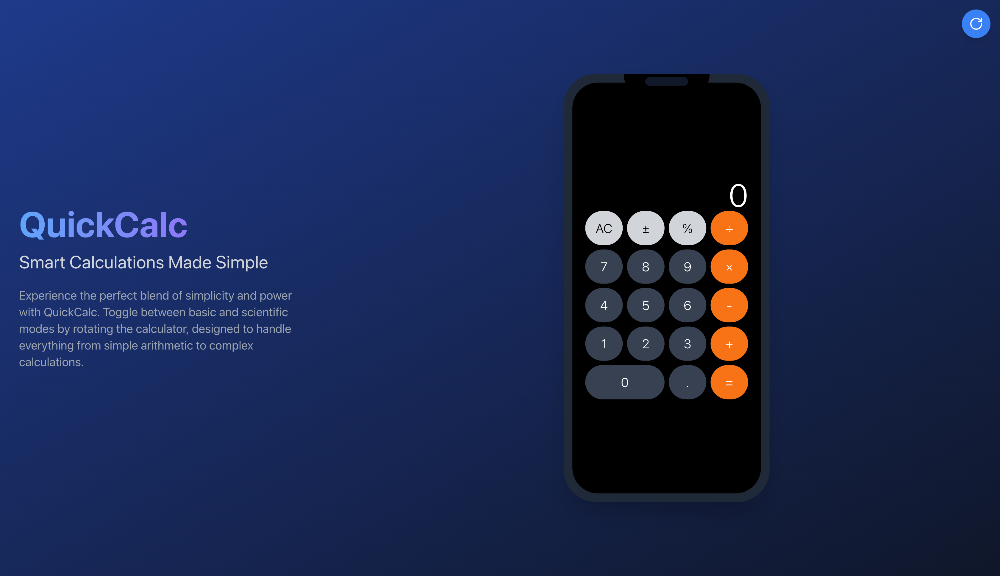

# 🔢 QuickCalc

**QuickCalc** - a modern calculator app with a sleek, user-friendly interface. Built using **React** and **Tailwind CSS** for a responsive, customizable design.

---

## 📋 Table of Contents

- [Project Overview](#project-overview)
- [Features](#features)
- [Project Structure](#project-structure)
- [Getting Started](#getting-started)
- [Available Scripts](#available-scripts)
- [Usage](#usage)
- [Preview](#preview)
- [License](#license)

---

## 🌐 Project Overview

**QuickCalc** is a calculator app designed to provide an efficient and elegant solution for basic calculations. Developed using **React** and styled with **Tailwind CSS**, it is responsive and compatible across various devices. Social media meta tags (Open Graph and Twitter Card) are included for enhanced visibility on platforms.

---

## ✨ Features

- **Responsive Design**: Built with Tailwind CSS for seamless experience on mobile and desktop.
- **Customizable Layout**: A clean and user-friendly interface for easy calculations.
- **Cross-Browser Compatibility**: Optimized for consistent performance on different devices and browsers.
- **Social Media Ready**: Includes Open Graph and Twitter Card meta tags for enhanced sharing.

---

## 📂 Project Structure

```plaintext
├── .gitattributes
├── .gitignore
├── LICENSE
├── README.md
├── package-lock.json
├── package.json
├── postcss.config.js
├── public
│   ├── favicon.ico
│   ├── favicon_io
│   │   ├── android-chrome-192x192.png
│   │   ├── android-chrome-512x512.png
│   │   ├── apple-touch-icon.png
│   │   ├── favicon-16x16.png
│   │   ├── favicon-32x32.png
│   │   └── site.webmanifest
│   ├── index.html
│   └── og_image.png
├── src
│   ├── App.js
│   ├── components
│   │   └── Calculator.js
│   ├── index.css
│   └── index.js
└── tailwind.config.js
```
## 🚀 Getting Started

### Prerequisites

- **Node.js** (v14+)
- **npm** (v6+)

### Installation

1. **Clone the repository:**

   ```bash
   git clone https://github.com/your-username/quickcalc.git

2.	Navigate to the project directory:
    ```bash
    cd quickcalc

3.	Install dependencies:
    ```bash
    npm install

4.	Start the development server:
    ```bash
    npm start

5.	Build for production:
    ```bash
    npm run build

## 📜 Available Scripts

- `npm start`: Runs the app in development mode.
- `npm run build`: Builds the app for production, outputting files to the `dist` folder.

## 💻 Usage

After installation, access the app by visiting `http://localhost:3000` in your browser. For online hosting, consider deploying it to a platform like Vercel or Netlify.

## 👀 Preview

Here’s a sneak peek of the QuickCalc app:



## 📄 License

This project is licensed under the **MIT License**. See the [LICENSE](./LICENSE) file for details.
